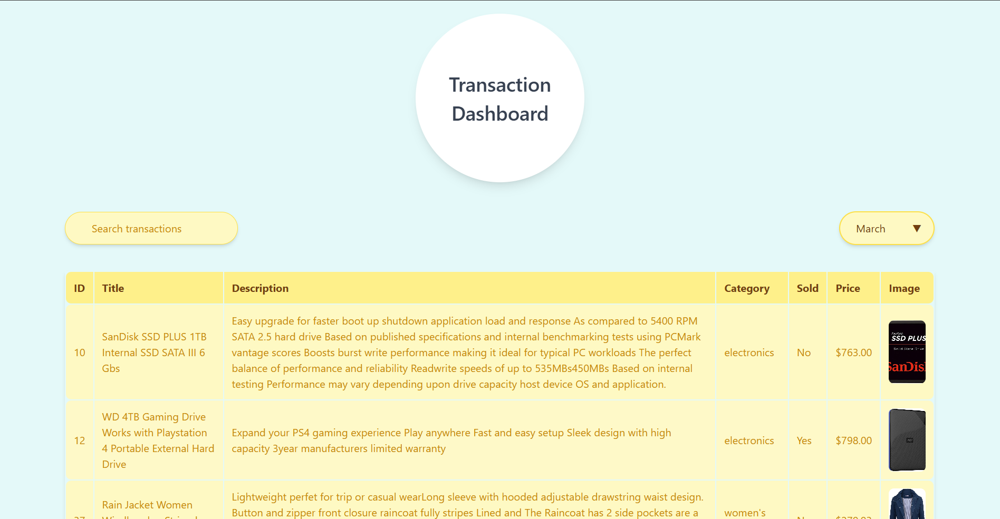

# Roxiler MERN Stack Assignment Submission ✅

### Live Link: [https://roxiler-assignment.deepanshu-sahu-projects.live/](https://roxiler-assignment.deepanshu-sahu-projects.live/)




## Overview

This project is a MERN (MongoDB, Express, React, Node.js) stack application created for the Roxiler coding challenge. The backend APIs perform data fetching, processing, and display functionalities for product transactions, including statistical summaries and chart visualizations based on monthly data.

The project consists of several endpoints to retrieve and visualize transaction data, with the following primary features:
- Database seeding from a third-party API
- Transaction listing with search and pagination
- Statistical data generation
- Data visualizations for a bar chart.

## Implementation

All backend APIs are implemented using **Express.js** in Node.js. These APIs provide comprehensive access to transaction data, including filtering, pagination, and statistical summaries.

### Key Functionalities

1. **Data Initialization**:
   - Fetches data from a third-party API at [`https://s3.amazonaws.com/roxiler.com/product_transaction.json`](https://s3.amazonaws.com/roxiler.com/product_transaction.json) and seeds it into the MongoDB database. The data is structured efficiently to enable fast querying and retrieval.

2. **API Endpoints**:
   - **Transaction Listing**: Allows searching, filtering by product title/description/price, and paginating through all    
       transactions.
   - **Statistics Generation**: Provides summary statistics for a specified month, including:
     - Total sale amount
     - Number of items sold
     - Number of items not sold
   - **Bar Chart Data**: Returns price ranges and counts of items in each range for the selected month.
   - **Pie Chart Data**: Lists unique product categories and item counts for each category in the selected month.
   - **Combined Data Endpoint**: Aggregates the data from the above APIs into a single response for ease of frontend 
       display.

3. **Data Visualization**:
   - Created a **Statistics** table that displays detailed statistics alongside bar chart data for easier data 
     interpretation.
   - The charts use dynamically processed data for enhanced visualization and reporting using `Chart.js`.

4. **API Documentation**:
   - All APIs have been thoroughly documented in a `Postman workspace` for easy testing and reference. Access the [postman 
     workspace](https://postman.com/path/to/your/workspace).

5. **Deployment**:
   - The app is deployed on `Vercel` for reliable, serverless hosting. Access the live app at [https://roxiler- 
   assignment.deepanshu-sahu-projects.live/](https://roxiler-assignment.deepanshu-sahu-projects.live/).


## Installation and Setup

Follow these steps to get the project running locally:

### Steps:

1. **Clone the Repository**:

   ```bash
   git clone https://github.com/dee077/Roxiler_Assignment.git
   ```

2. **Install Frontend Dependencies:**:

   ```bash
   cd frontend
   npm install
   ```

3. **Install Backend Dependencies:**:

   ```bash
   cd ../backend
   npm install
   ```
4. **Create .env file**:

   ```bash
   MONGO_URI=<Your_MongoDB_URI>
   THIRD_PARTY_API_URL=https://s3.amazonaws.com/roxiler.com/product_transaction.json
   PORT=5000
   ```

4. **Start Backend and Frontend**:
   In Terminal 1:
   ```bash
   cd frontend
   npm start
   ```
   In Terminal 2:
   ```bash
   cd backend
   npm start
   ```
   Access the app at `http://localhost:3000` and keep the backend running on `http://localhost:3000`.

## API Endpoints

The following API endpoints have been created to fulfill the assignment requirements. Each endpoint accepts a month as input, which is matched against the `dateOfSale` field regardless of the year.

### 1. Initialize Database
   - **Endpoint**: `GET /api/initialize-db`
   - **Description**: Initializes the database by fetching the product transaction data from a third-party API 
      (`https://s3.amazonaws.com/roxiler.com/product_transaction.json`) and populating the MongoDB database with seed data. 
      This is a one-time setup endpoint to populate the database with transaction records.
   - **Example Request**:
     ```http
     GET https://roxiler-assignment-be.vercel.app/api/init
     ```

### 2. List All Transactions
   - **Endpoint**: `GET /api/transactions`
   - **Description**: Lists all product transactions, with support for search and pagination.
   - **Parameters**:
     - `search` (optional): Filters transactions based on product `title`, `description`, or `price`.
     - `page` (optional): Page number for pagination (default: 1).
     - `perPage` (optional): Number of records per page (default: 10).
   - **Example Request**:
     ```http
     GET https://roxiler-assignment-be.vercel.app/api/list-transactions
     ```

### 2. Statistics
   - **Endpoint**: `GET /api/statistics`
   - **Description**: Provides key statistics for a selected month.
   - **Response Data**:
     - `totalSaleAmount`: Total sale amount for the selected month.
     - `soldItems`: Total number of sold items for the month.
     - `notSoldItems`: Total number of not-sold items for the month.
   - **Example Request**:
     ```http
     GET https://roxiler-assignment-be.vercel.app/api/list-transactions
     ```

### 3. Bar Chart Data (Price Range Analysis)
   - **Endpoint**: `GET /api/barchart`
   - **Description**: Provides data for a bar chart showing item counts in specific price ranges for the selected month.
   - **Price Ranges**:
     - `0 - 100`
     - `101 - 200`
     - `201 - 300`
     - `301 - 400`
     - `401 - 500`
     - `501 - 600`
     - `601 - 700`
     - `701 - 800`
     - `801 - 900`
     - `901+`
   - **Example Request**:
     ```http
     GET https://roxiler-assignment-be.vercel.app/api/bar-chart?month=March
     ```

### 4. Pie Chart Data (Category Analysis)
   - **Endpoint**: `GET /api/piechart`
   - **Description**: Provides data for a pie chart showing unique categories and the number of items in each category for the selected month.
   - **Example Request**:
     ```http
     GET https://roxiler-assignment-be.vercel.app/api/pie-chart?month=March
     ```

### 5. Combined Data (All APIs in One)
   - **Endpoint**: `GET /api/combined`
   - **Description**: Combines responses from the `transactions`, `statistics`, `barchart`, and `piechart` endpoints for comprehensive data analysis.
   - **Example Request**:
     ```http
     GET https://roxiler-assignment-be.vercel.app/api/combined-data?month=March
     ```


## Submission

I have completed the assignment as per the given requirements and it is ready for submission. <br>
Thank you! <br>
Deepanshu Sahu